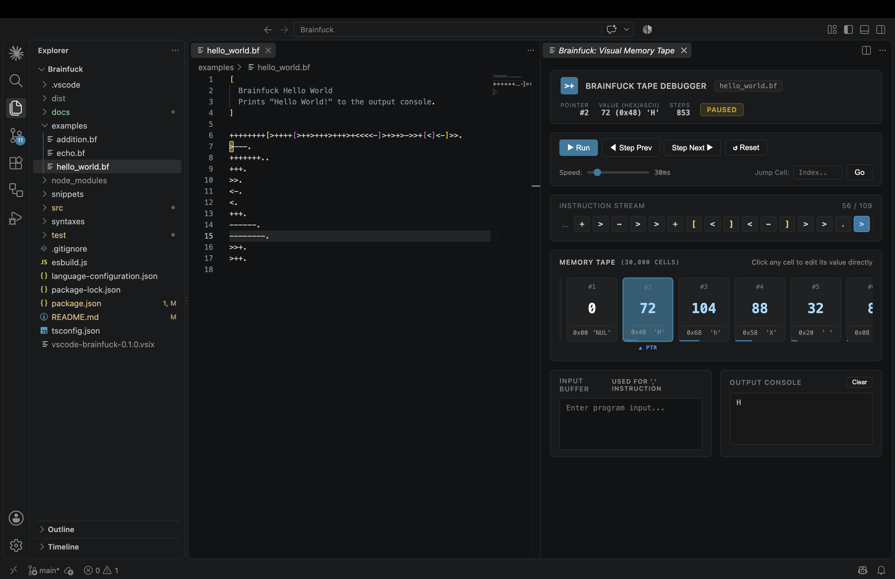

# VS Code Brainfuck Language Support & Visual Tape Debugger

> **The all-in-one, zero-dependency Brainfuck development studio & visual debugger for VS Code.**

[](package.json)
[](LICENSE)
[](#)
[](https://code.visualstudio.com/)

A standalone, batteries-included development environment for Visual Studio Code. Write, format, lint, run, and visually debug Brainfuck programs with zero external compilers, runtimes, or configurations required.



---

## ⚡ Features

### 1. 🎨 Advanced Syntax Highlighting & Clean Minimap
- Colors all 8 core Brainfuck instructions by functional categories:
  - **Pointer Movement (`>`, `<`):** Blue / Cyan
  - **Value Mutation (`+`, `-`):** Green
  - **I/O Commands (`.`, `,`):** Red / Pink
  - **Loop Brackets (`[`, `]`):** Yellow / Amber
  - **Debugger Breakpoint (`#`):** Magenta
  - **Comments:** Standard `//` single-line and `/* ... */` multi-line block comments, plus free-form text.
- **Clean Minimap:** Optimized folding configuration prevents loop brackets from inflating into oversized block markers on the VS Code minimap.
- Bracket pair colorization and auto-closing bracket support.

### 2. 💡 Intelligent Hover Provider & Idiom Inspector
Hover over any instruction, loop bracket, or code sequence to inspect rich, formatted information in real-time:
- **Loop Bracket Pairing & Jump Targets:** Hovering over `[` or `]` reveals matching coordinates (Line, Column), nested loop depth, inner instruction count, and jump condition (`while (*ptr != 0)`).
- **Cell Value Adjustment Tooltips:** Hovering over consecutive `+` / `-` clusters reveals net value change (e.g. `+7`), hex equivalent (`0x07`), and ASCII character representation (e.g. `'A'`, `'\n'`, `'\t'`).
- **Pointer Shifts:** Hovering over `>` / `<` sequences shows net pointer offset and movement direction (`Move Right/Left X cells`).
- **Brainfuck Idiom Recognition:** Automatically detects and explains canonical Brainfuck algorithms with C-equivalents:
  - `[-]` / `[+]` $\rightarrow$ **Clear Cell** (`*ptr = 0;`)
  - `[->+<]` / `[-<+>]` $\rightarrow$ **Move / Add Cell** (`*(ptr + 1) += *ptr; *ptr = 0;`)
  - `[->+>+<<]` $\rightarrow$ **Copy Cell** (`ptr[1] += *ptr; ptr[2] += *ptr; *ptr = 0;`)
  - `[>]` / `[<]` $\rightarrow$ **Scan to Zero** (`while (*ptr) ptr++;`)
- **I/O & Breakpoint Details:** Inspect `.`, `,`, `#` (pauses visual tape debugger), and comment blocks.

### 3. ⚡ High-Performance IR Bytecode Engine (50x – 500x Speedup)
Includes a specialized optimizing bytecode compiler and virtual machine for lightning-fast execution:
- **Run-Length Encoding (RLE):** Collapses consecutive arithmetic operations (`+`/`-`) and pointer movements (`>`/`<`) into atomic `ADD` and `MOVE` instructions.
- **Clear Loop Folding:** Detects `[-]` and `[+]` reset loops and folds them into an instantaneous `SET 0` operation instead of iterating hundreds of cycles.
- **Scan Loop Folding:** Detects memory search loops such as `[>]` and `[<]` and translates them into vectorized zero-byte scan operations (`SCAN`).
- **Multiplication & Cell Transfer Folding:** Translates copy/multiplication loops such as `[->+<]`, `[->+++<]`, and `[->+>++<<]` into direct `ADD_MULT` arithmetic, executing heavy calculations in zero loop iterations.
- **Configurable Optimization:** Easily toggle between `aggressive` (default), `basic` (RLE only), and `none` (pure step-by-step) via extension settings.

### 4. 🔍 Real-Time Diagnostics
- **Unclosed loop bracket (`[`):** Flagged with red underlines when no matching `]` exists.
- **Unmatched closing bracket (`]`):** Flagged immediately when no preceding `[` exists.
- **Empty loop warning (`[]`):** Generates a warning diagnostic for potential infinite loops.

### 5. 📼 Visual Memory Tape & Time-Travel Debugger
High-performance, smooth memory visualizer built with native VS Code design tokens:
- **Ultra-Fast Adaptive Engine:** Adjustable step delay from `1ms` to `1000ms`. At high speeds, an adaptive batching scheduler executes up to 1,000+ steps per second while maintaining smooth 60fps DOM rendering.
- **Direct Cell Jump Control:** Interactive `Cell: [#ptr]` inline input with boundary clamping (`0` to `29999`) to instantly inspect any memory location.
- **50-Cell Conveyor Tape View:** Extended sliding tape window smoothly centered around the active memory pointer.
- **Live Cell Inspector:** Displays Decimal, Hex (`0x00`), and ASCII character representations for every memory cell.
- **Time-Travel Debugging:**
  - **Step Next (`▶` / `Right Arrow`):** Advance execution by one instruction.
  - **Step Prev (`◀` / `Left Arrow`):** Step backward (restores tape memory, pointer, and console output).
  - **Run / Pause (`Space`):** Continuous auto-execution with dynamic speed control.
  - **Reset (`R`):** Reset tape memory, pointer, and output console.
- **Bidirectional Editor Sync:** The currently executing instruction in the editor is highlighted with a gold focus indicator in real-time.
- **Direct Cell Editing:** Click any memory cell on the tape to directly modify its value (0 - 255).
- **Dedicated Terminal Output Console:** Full-width collapsible output console styled in native VS Code terminal design, supporting multi-line streams, monospace ASCII rendering, auto-scroll, 1-click clipboard copy, buffer wipe, word wrap toggle, and adjustable panel height.

### 6. 🚀 Output Channel Runner
- Execute Brainfuck code instantly via the editor title bar Run button or the command palette (`Brainfuck: Run Code in Output Channel`).
- Powered by the compiled IR Bytecode engine for instantaneous execution even on massive loops.
- Reports total execution operations, duration in milliseconds, and final memory state.

### 7. 🧹 Formatter & Minifier
- **Format Document (`Shift+Alt+F`):** Automatically indents loop blocks (`[` and `]`) for readability.
- **Minify Code:** Strips comments and whitespace to produce compact Brainfuck code.

### 8. 📝 Built-in Snippets
- `bf-hello` / `hello`: Standard Hello World program.
- `bf-clear` / `clear`: Cell reset `[-]`.
- `bf-move`: Move cell value `[->+<]`.
- `bf-copy`: Copy cell value `[->+>+<<]>>[-<<+>>]<`.
- `bf-add` / `bf-sub`: Addition and subtraction between cells.
- `bf-mult`: Multiplication loop template.

### 9. 🎛️ Explorer Icons, Title Bar & Interpreter Status Bar
- **Branded Explorer Icons:** Custom transparent `>+` badge icons for `.bf` and `.b` files in the VS Code explorer tree and editor tabs.
- **Dedicated Icon Theme:** Includes the official `Brainfuck (Official)` icon theme.
- **Editor Title Bar Integration:** Dedicated `$(circuit-board)` icon in the editor navigation bar for instant 1-click visual memory tape access.
- **Python-style Interpreter Status Bar:** Displays `$(chip) Brainfuck (Built-in)` in the bottom status bar whenever a Brainfuck file is active. Hovering reveals active runtime configuration (tape size, wrapping mode, step limits), and clicking opens a QuickPick control menu for rapid execution, debugging, settings, and code formatting.

---

## ⌨️ Shortcuts & Commands

| Command | Shortcut / Location | Description |
|---|---|---|
| `Brainfuck: Open Visual Tape Debugger` | Title Bar (`$(circuit-board)`) / Context Menu | Opens the interactive visual memory tape |
| `Brainfuck: Run Code in Output Channel` | Title Bar (`$(run)`) / Context Menu | Executes the code in the output channel |
| `Brainfuck: Select Interpreter Action / Settings` | Status Bar (`$(chip)`) / Command Palette | Opens the quick-action interpreter menu |
| `Brainfuck: Format / Indent Loops` | `Shift+Alt+F` / Context Menu | Indents and formats loops |
| `Brainfuck: Minify Code` | Command Palette / Context Menu | Strips comments and whitespace |

### Inside the Visual Debugger:
- **`Space`**: Run / Pause auto-execution
- **`Right Arrow` (`→`)**: Step Next instruction
- **`Left Arrow` (`←`)**: Step Prev (Time-Travel Undo)
- **`R`**: Reset memory tape, pointer, and output
- **`Speed: [...]ms`**: Click to type custom execution delay or drag slider
- **`Cell: [#...]`**: Click to directly jump to any memory cell (`0` – `29999`)
- **`Output Console`**: Native VS Code terminal style with 1-click **Copy**, **Clear**, **Wrap**, and **Collapse** action icons.

---

## ⚙️ Extension Settings

| Setting | Type | Default | Description |
|---|---|---|---|
| `brainfuck.tapeSize` | `integer` | `30000` | Memory tape capacity in cells. |
| `brainfuck.cellWrapping` | `boolean` | `true` | 8-bit cell wrapping (`0 - 1 = 255`, `255 + 1 = 0`). |
| `brainfuck.defaultRunDelayMs` | `integer` | `30` | Default execution delay in milliseconds between steps during auto-run. |
| `brainfuck.debugger.outputHeight` | `integer` | `150` | Maximum height (in pixels) for the terminal output console in the visual debugger. |
| `brainfuck.debugger.syncEditorOnStep` | `boolean` | `true` | Highlight the active instruction in the editor during debugger execution. |
| `brainfuck.debugger.visibleCells` | `integer` | `50` | Number of cells displayed in the memory tape conveyor viewport. |
| `brainfuck.debugger.visibleInstructions` | `integer` | `100` | Number of instruction characters displayed in the debugger instruction stream around the active instruction. |
| `brainfuck.execution.clearPreviousOutput` | `boolean` | `false` | Clear the Brainfuck Output channel before each execution run. |
| `brainfuck.execution.showSummary` | `boolean` | `true` | Print execution metrics (step count, elapsed time, final cell) upon completion. |
| `brainfuck.execution.optimizationLevel` | `string` | `"aggressive"` | Optimization level for execution: `"aggressive"` (IR bytecode with loop folding, 50x-500x faster), `"basic"` (RLE contraction), or `"none"` (standard single-step). |
| `brainfuck.hover.enable` | `boolean` | `true` | Enable rich hover tooltips for loop bracket matching, value adjustments, pointer shifts, and Brainfuck idioms. |
| `brainfuck.diagnostics.enable` | `boolean` | `true` | Enable real-time syntax checking and bracket balancing diagnostics. |
| `brainfuck.diagnostics.warnOnEmptyLoops` | `boolean` | `true` | Warn about redundant infinite loops like `[]`. |

Additionally, Brainfuck files automatically default to `"editor.wordWrap": "on"` for seamless code editing.

---

## 📂 Examples Included

The repository comes with ready-to-run Brainfuck examples in the [`examples/`](examples) directory:
- [`hello_world.bf`](examples/hello_world.bf): Standard Hello World program.
- [`addition.bf`](examples/addition.bf): Multi-cell addition algorithm with memory walkthrough.
- [`echo.bf`](examples/echo.bf): Character echo demonstrating interactive `,` input.

---

## 🛠️ Development & Testing

```bash
# Install dependencies
npm install

# Compile with TypeScript and esbuild
npm run compile

# Run unit tests
npm test

# Press F5 in VS Code to launch the Extension Development Host!
```

---

## 📄 License

MIT License © [Ohualtex](https://github.com/Ohualtex)
